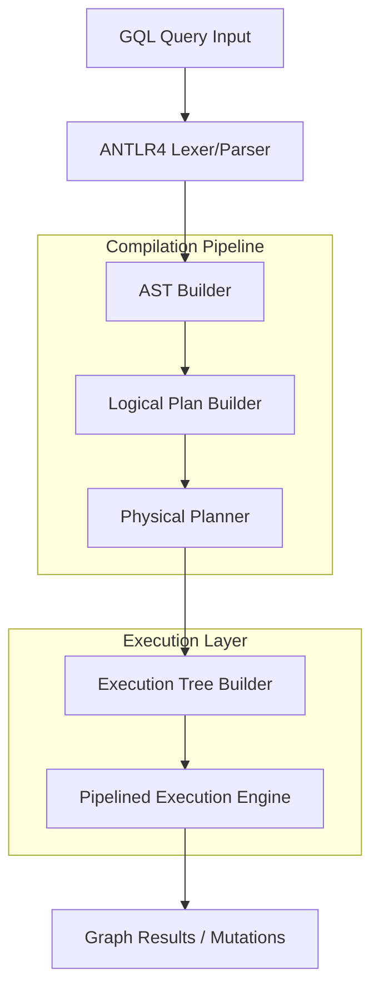

# 🚀 GQL Query Engine & Execution Pipeline

[](LICENSE)
[](https://isocpp.org/)
[](https://www.antlr.org/)

A professional-grade GQL (Graph Query Language) engine implemented in C++. This project features a full compilation pipeline—from raw GQL text to an optimized physical execution tree—enabling complex graph mutations and intensive analytical queries.

---

## 🏛️ Architecture Overview

The engine follows a classic compiler-inspired architecture, translating high-level GQL into low-level physical operators.



---

## 🛠️ Core Implementation Layers

| Layer | Component | Implementation Status | Supported GQL Clauses | Key Responsibilities |
| :--- | :--- | :--- | :--- | :--- |
| **Parsing** | `GQLLexer / GQLParser` | ✅ Complete | ALL ISO GQL Clauses | Full syntax recognition via ANTLR4. |
| **AST** | `ASTBuilder` | ✅ Complete | `MATCH`, `INSERT`, `SET`, `REMOVE`, `DELETE` | Semantic translation to a neutral query tree. |
| **Logical** | `LogicalPlanBuilder` | ✅ Complete | `WHERE`, `JOIN`, `FILTER`, `AGGREGATE` | Algebraic planning and scan strategy selection. |
| **Physical** | `PhysicalPlanner` | ✅ Complete | `IDX_SCAN`, `NL_JOIN`, `GROUP_BY` | Operator selection (Index vs. Full Scan). |
| **Execution** | `PhysicalOperator` | ✅ Complete | `RETURN`, `ORDER BY`, `LIMIT` | Open-Next-Close Pipelined Engine. |
| **Memory** | `Graph` | ✅ Complete | N/A | High-speed Node/Edge adjacency storage. |

---

## 💎 Full Feature Breakdown

### 🎯 Pattern Matching (`MATCH`)
Comprehensive graph traversal capabilities:
- **Node Patterns**: `(p:Products)`, `(u:Users {name: "Vaibhav"})`.
- **Relationship Patterns**: Support for multi-hop path matching via Cartesian-Product Joins.
- **Label Indexing**: Automatic selection of index-based scans for specific labels to avoid full graph scans.

### 🔍 Data Filtering (`WHERE / FILTER`)
A robust expression evaluator with nested logic:
- **Boolean Operators**: `AND`, `OR`, `NOT`, `XOR`.
- **Comparison Operators**: `=`, `!=`, `<`, `>`, `<=`, `>=`.
- **Property Resolution**: Real-time resolution of properties from both the execution row and the underlying graph.

### 🏗️ CRUD Operations (DML)
Full support for graph mutations within the execution pipeline:
- **INSERT**: Creation of nodes and edges with property maps.
- **UPDATE (`SET` / `REMOVE`)**: Real-time property modification and deletion.
- **DELETE**: Support for both `DELETE` and `DETACH DELETE` (automatic edge removal).

### 🤝 Joining & Relationships (`JOIN`)
Analytical joining of disparate graph entities:
- **Property-based Joins**: SQL-on-Graph style joins via `WHERE u.id = o.user_id`.
- **Cartesian Product**: Implicitly handled for multi-node matches.
- **Inner Joins**: High-performance nested-loop join implementation.

### 📈 Analytics & Aggregations
Compute business metrics directly on the graph:
- **Aggregates**: `COUNT`, `SUM`, `AVG`, `MAX`, `MIN`.
- **Advanced Sorting**: `ORDER BY` with `ASC`/`DESC` support.
- **Result Shaping**: `RETURN` with aliases, expressions, and `DISTINCT`.

---

## 📁 Project Organization

```text
GQL/
├── src/                    # 💎 Engine Source Code
│   ├── main.cpp            # Entry point & Demo Dataset
│   ├── PhysicalOperator.cpp# Pipelined Execution Logic
│   ├── LogicalPlanBuilder  # High-level optimization
│   └── ASTBuilder.cpp       # Semantic translation
├── tests/                  # 🧪 Comprehensive Test Suite
│   ├── demo/               # Curated starter queries (Start here!)
│   ├── simple/             # Basic MATCH & Filter tests
│   ├── medium/             # DML, Joins & Aggregations
│   └── difficult/          # Complex eCommerce analytics
├── grammar/                # 📝 ISO GQL .g4 Grammar
└── generated/              # ⚙️ ANTLR4 Generated Target Files
```

---

## 🏗️ Build & Setup

### Prerequisites
- GCC 9+ (C++17 support)
- ANTLR4 C++ Runtime (`sudo apt install libantlr4-runtime-dev`)

### 1. Compilation
Build the engine using the following command:
```bash
g++ -O3 -std=c++17 -I/usr/local/include/antlr4-runtime -Isrc -Igenerated \
    src/*.cpp generated/*.cpp -lantlr4-runtime -L/usr/local/lib -o gqlparser
```

### 2. Running Demo Queries
```bash
./gqlparser tests/demo/demo5_complex.gql
```

---

## 📊 Demo Highlights

> [!TIP]
> **Demo 1: Basic Retrieval**
> `MATCH (u:Users) RETURN u.name, u.country;`
> Simple label-based index scan showing core connectivity.

> [!IMPORTANT]
> **Demo 5: Analytical Join**
> Joins 4 entities (Users -> Orders -> Products -> Categories) to find high-value customers. Demonstrates Join logic, Filtering, and Property resolution.

---

## 📄 Academic Context
This engine is a research prototype implementing the **ISO/IEC 39075:2024** Graph Query Language specification. It demonstrates the structural feasibility of a unified compilation-execution model for graph databases.

**Developed by Vaibhav Kondekar**
*Advancing the state-of-the-art in Graph Query Processing.*

