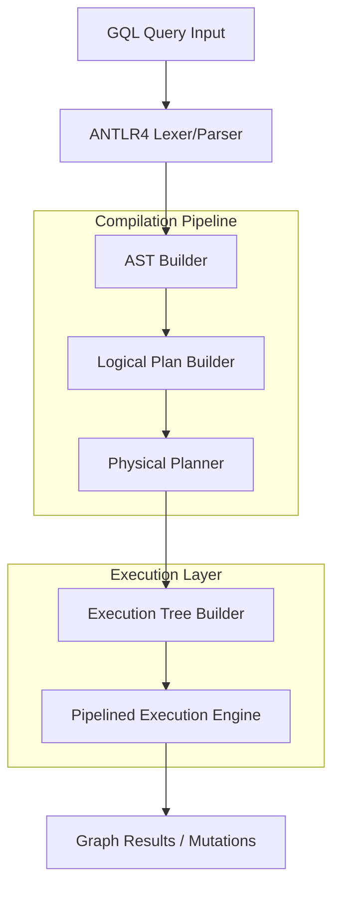

# GQL Query Engine and Execution Pipeline

[](LICENSE)
[](https://isocpp.org/)
[](https://www.antlr.org/)

A professional-grade Graph Query Language (GQL) engine implemented in C++. This project features a full compilation pipeline, translating raw GQL queries into optimized physical execution trees for graph mutations and analytical processing on an in-memory property graph.

---

## Architecture Overview

The engine utilizes a compiler-inspired architecture to translate high-level GQL into low-level physical operators through several distinct phases of translation and optimization.



---

## Core Implementation Layers

| Layer | Component | Implementation Status | Key Responsibilities |
| :--- | :--- | :--- | :--- |
| **Parsing** | `GQLLexer / GQLParser` | Complete | Syntax recognition and parse tree generation via ANTLR4. |
| **AST** | `ASTBuilder` | Complete | Semantic translation and structural validation. |
| **Logical** | `LogicalPlanBuilder` | Complete | Algebraic planning and high-level query optimization. |
| **Physical** | `PhysicalPlanner` | Complete | Operator selection and scan strategy optimization. |
| **Execution** | `PhysicalOperator` | Complete | Pipelined "Open-Next-Close" iterator engine implementation. |
| **Memory** | `Graph` | Complete | High-speed adjacency-list based property graph storage. |

---

## Layer-by-Layer Implementation Details

### 1. Parser Layer
The parsing layer is built using ANTLR4 and is based on the ISO/IEC 39075:2024 GQL specification. It performs lexical and syntactic analysis of the input GQL query.
- **Syntax Validation**: The parser immediately identifies and reports structural errors in the query.
- **Fail-Fast Mechanism**: Integrated within the system to abort the pipeline if syntax errors are detected, providing precise line and character markers for debugging.

### 2. AST (Abstract Syntax Tree) Layer
The `ASTBuilder` traverses the ANTLR parse tree and constructs a semantic representation of the query.
- **Query Structuring**: Identifies the primary intent (Statement Block, Query Primary) and organizes clauses into a hierarchical tree of `ASTNode` objects.
- **DML Identification**: Distinguishes between data-accessing (MATCH, RETURN) and data-modifying (INSERT, SET, DELETE) operations for specialized planning.

### 3. Logical Planning Layer
The `LogicalPlanBuilder` transforms the AST into an algebraic representation of the query.
- **Join Resolution**: Converts multi-node matches into logical join operations.
- **Filter Pushdown**: Prepares filter conditions for optimization, ensuring that predicates are applied as early as possible in the execution stream.
- **Aggregation Logic**: Identifies grouping keys and aggregate functions (COUNT, SUM, AVG) for subsequent physical mapping.

### 4. Physical Planning Layer
The `PhysicalPlanner` optimizes the logical plan by choosing specific execution strategies.
- **Scan Optimization**: Automatically selects `MemLabelScan` over `MemFullScan` when label-based search is identified, significantly reducing search space.
- **Join Strategy**: Maps logical joins to `MemNestedLoopJoin` or other optimized physical operators.
- **DML Ordering**: Ensures that mutations (SET, DELETE) occur at the correct stage in the pipeline to maintain data integrity and visibility.

### 5. Execution Layer
The execution engine implements a pull-based pipelined model, often referred to as the Volcano or Iterator model.
- **Interface**: Each operator implements `open()`, `next()`, and `close()` methods.
- **Pipelining**: Data flows through the tree without materialized intermediate states, reducing memory overhead for large analytical queries.
- **Real-time Mutation**: DML operators modify the in-memory graph as rows pass through the pipeline, while subsequent `RETURN` clauses retrieve the updated state via immediate property resolution.

---

## Project Organization

```text
GQL/
├── src/                    # Engine Source Code
│   ├── main.cpp            # Entry point & eCommerce Dataset
│   ├── PhysicalOperator.cpp# Pipelined Execution Logic
│   ├── LogicalPlanBuilder  # Logical Plan Generation
│   └── ASTBuilder.cpp       # Semantic Tree Construction
├── tests/                  # Categorized Test Suite
│   ├── demo/               # Curated Demonstration Queries
│   ├── simple/             # Basic MATCH & Filter Tests
│   ├── medium/             # DML, Joins & Aggregations
│   └── difficult/          # Complex eCommerce Analytics
├── grammar/                # ISO GQL .g4 Grammar Files
└── generated/              # ANTLR4 Generated Target Files
```

---

## Build and Setup

### Prerequisites
- GCC 9+ (C++17 support)
- ANTLR4 C++ Runtime (`sudo apt install libantlr4-runtime-dev`)

### 1. Compilation
The system can be compiled using the following command:
```bash
g++ -O3 -std=c++17 -I/usr/local/include/antlr4-runtime -Isrc -Igenerated \
    src/*.cpp generated/*.cpp -lantlr4-runtime -L/usr/local/lib -o gqlparser
```

### 2. Running Demonstration Queries
The engine includes a built-in eCommerce dataset. Execution of demonstration queries can be performed as follows:
```bash
./gqlparser tests/demo/demo5_complex.gql
```

---

## Technical Highlights

> **Label-Based Search**
> The engine utilizes label-based scans to optimize node retrieval, ensuring that `MATCH (n:Label)` operations bypass full graph iterations.

> [!IMPORTANT]
> **Atomic Mutations**
> Data modifications in the execution pipeline are applied directly to the internal `Graph` representation, ensuring strict consistency for analytical results within the same execution cycle.

---

## Academic Context
This engine is a research prototype implementing the ISO/IEC 39075:2024 Graph Query Language specification. It demonstrates the structural feasibility of a unified compilation-execution model for graph database systems.

**Developed by Vaibhav Kondekar**
*Advancing methodologies in Graph Query Processing.*

