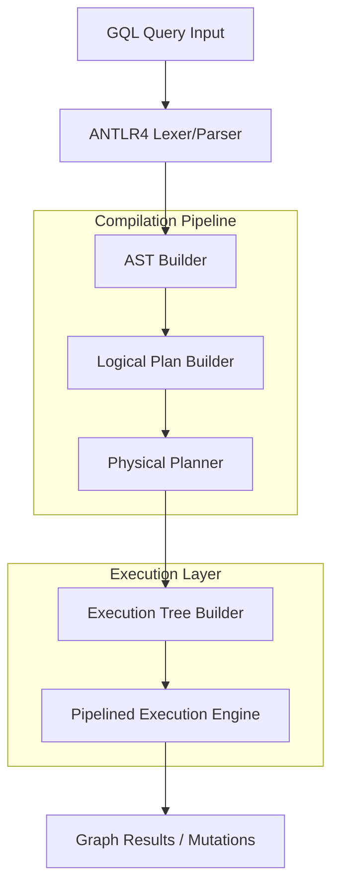

# 🚀 GQL Query Engine & Execution Pipeline

[](LICENSE)
[](https://isocpp.org/)
[](https://www.antlr.org/)

A robust, high-performance GQL (Graph Query Language) engine implemented in C++. This project features a full compilation pipeline—from raw GQL text to an optimized physical execution tree—enabling complex graph mutations and analytical queries on an in-memory property graph.

---

## 🏛️ Architecture Overview

The engine follows a classic compiler-inspired architecture, translating high-level GQL into low-level physical operators.



---

## 🛠️ Core Implementation Layers

| Layer | Component | Implementation Status | Key Responsibilities |
| :--- | :--- | :--- | :--- |
| **Parsing** | `GQLLexer / GQLParser` | ✅ Complete | Full ISO GQL syntax recognition via ANTLR4. |
| **AST** | `ASTBuilder` | ✅ Complete | Translates parse tree to a semantic, visitor-ready tree. |
| **Logical** | `LogicalPlanBuilder` | ✅ Complete | High-level algebraic planning (Scans, Joins, Filters). |
| **Physical** | `PhysicalPlanner` | ✅ Complete | Optimizes scans (Index vs. Full) and chooses Join strategies. |
| **Execution** | `PhysicalOperator` | ✅ Complete | Pipelined "Open-Next-Close" iterator engine. |
| **Memory** | `Graph` | ✅ Complete | In-memory property graph with Node/Edge storage. |

---

## ✨ Key Features

### 1. Pipelined DML (CRUD)
Unlike basic parsers, this engine supports real-time mutations within the same query pipeline.
```gql
-- Match, Update, and Return in a single stream
MATCH (u:Users) WHERE u.name = "Vaibhav"
SET u.country = "India", u.status = "VIP"
RETURN u.name, u.country, u.status;
```

### 2. High-Performance Joins & Analytics
Supports property-based joins and complex aggregations with `DISTINCT` support.
- **Aggregates**: `COUNT`, `SUM`, `AVG`, `MAX`, `MIN`.
- **Joins**: Implicitly handled via property-matching in `WHERE` clauses (SQL-on-Graph style).

### 3. Professional Error Handling (Fail Fast)
Integrated syntax error detection that aborts execution immediately with descriptive markers, preventing invalid plans.

---

## 📁 Project Organization

```text
GQL/
├── src/                    # 💎 Engine Source Code
│   ├── main.cpp            # Entry point & Demo Dataset
│   ├── PhysicalOperator.cpp# Pipelined Execution Logic
│   ├── LogicalPlanBuilder  # High-level optimization
│   └── ASTBuilder.cpp       # Semantic translation
├── tests/                  # 🧪 Comprehensive Test Suite
│   ├── demo/               # Curated starter queries (Start here!)
│   ├── simple/             # Basic MATCH & Filter tests
│   ├── medium/             # DML, Joins & Aggregations
│   └── difficult/          # Complex eCommerce analytics
├── grammar/                # 📝 ISO GQL .g4 Grammar
└── generated/              # ⚙️ ANTLR4 Generated Target Files
```

---

## 🏗️ Build & Setup

### Prerequisites
- GCC 9+ (C++17 support)
- ANTLR4 C++ Runtime (`sudo apt install libantlr4-runtime-dev`)

### 1. Compilation
Build the engine using the following command:
```bash
g++ -O3 -std=c++17 -I/usr/local/include/antlr4-runtime -Isrc -Igenerated \
    src/*.cpp generated/*.cpp -lantlr4-runtime -L/usr/local/lib -o gqlparser
```

### 2. Running Demo Queries
The engine includes a built-in eCommerce dataset (Users, Orders, Products, Categories). You can run any `.gql` file:
```bash
./gqlparser tests/demo/demo5_complex.gql
```

---

## 📊 Demo Scenarios

We have curated a set of queries to walk through the engine's capabilities:

> [!TIP]
> **Demo 1: Basic Retrieval**
> `MATCH (u:Users) RETURN u.name, u.country;`
> Simple label-based index scan.

> [!IMPORTANT]
> **Demo 5: Multi-hop Analytical Join**
> Joins 4 different entities (Users -> Orders -> Products -> Categories) to find high-value customers in specific categories.

---

## 📄 Academic Context
This engine is a research prototype implementing the **ISO/IEC 39075:2024** Graph Query Language specification. It demonstrates the feasibility of a pipelined execution model for property graph mutations.

**Developed by Vaibhav Kondekar**
*Building the future of Graph Query Processing.*

