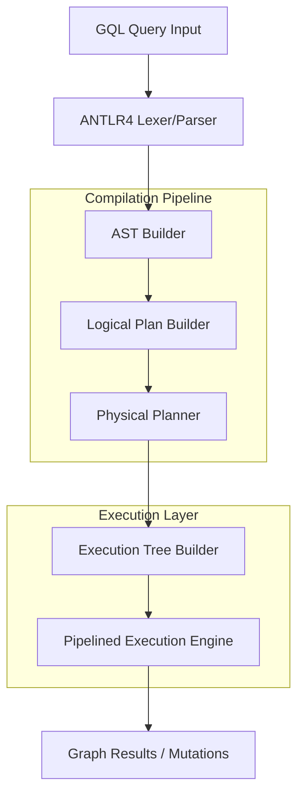

# GQL Engine
**A High-Performance C++ Graph Query Language Engine based on the ISO GQL Standard**

GQL Engine is a fast, lightweight, and portable embedded graph query engine that brings the power of the ISO/IEC 39075:2024 Graph Query Language (GQL) standard into a seamless compilation-to-execution pipeline.

Built using a compiler-inspired architecture, GQL transforms high-level declarative graph queries into optimized physical execution plans. The system is designed to support efficient graph traversal, analytical workloads, and extensible query execution strategies.

---

## Features

- **ISO GQL Standard Compliance**  
  Implements core concepts from the ISO/IEC 39075:2024 specification for standardized graph querying.

- **Pattern Matching Engine**  
  Efficient node and relationship traversal using `MATCH` clauses and complex path patterns.

- **Pipelined Execution Model**  
  Volcano-style iterator model (`Open → Next → Close`) for memory-efficient and scalable execution.

- **Multi-Stage Query Pipeline**  
  Seamless transformation: `GQL Query` → `AST` → `Logical Plan` → `Physical Plan` → `Execution Tree`.

- **Graph Workbench (Web UI)**  
  Interactive, web-based interface for real-time query execution, metrics tracking, and graph visualization.

- **Embedded Architecture**  
  No external server required — designed as a standalone execution engine or an embeddable library.

- **Modern C++17 Implementation**  
  High-performance, memory-efficient design leveraging modern C++ standards and ANTLR4.

---

## Architecture Overview

The GQL Engine follows a structured compiler-style query processing pipeline:


```mermaid
graph TD
    A[GQL Query Input] --> B[ANTLR4 Lexer/Parser]
    B --> C[AST Builder]
    C --> D[Logical Plan Builder]
    D --> E[Physical Planner]
    E --> F[Execution Tree Builder]
    F --> G[Pipelined Execution Engine]
    G --> H[Graph Results / Mutations]

    subgraph Compilation Pipeline
        C
        D
        E
    end

    subgraph Execution Layer
        F
        G
    end
```

---

## Prerequisites

Before building GQL, ensure the following dependencies are installed:

### System Requirements
* **GCC/G++ >= 9** — Required for C++17 support.
* **ANTLR4 C++ Runtime**
  ```bash
  sudo apt install libantlr4-runtime-dev
  ```
* **Node.js & npm** — Required for the Web Workbench interface.

---

## Getting Started

### Step 1: Clone & Build
```bash
git clone https://github.com/omk18p/GQL.git
cd GQL
./build.sh
```
This generates the `gqlparser` executable in the root directory.

### Step 2: Run a Query (CLI)
```bash
./gqlparser tests/demo/demo5_complex.gql
```

### Step 3: Launch the Workbench (Web UI)

**Terminal 1: Backend API**
```bash
cd web/backend
node server.js
```

**Terminal 2: Frontend UI**
```bash
cd web/frontend
npm run dev
```

Open in your browser: [http://localhost:5173](http://localhost:5173)

---

## Project Structure
```text
GQL/
├── src/          # Core engine (AST, logical/physical planning, execution)
├── tests/        # Query test suites (Demo, Simple, Medium, Difficult)
├── grammar/      # ISO GQL ANTLR4 grammar files (.g4)
├── generated/    # ANTLR4 generated parser code
├── web/          # Web Workbench (Vite/React frontend + Node.js backend)
└── build.sh      # Automated build script
```

---

## Testing

GQL includes a structured test suite categorized by analytical complexity:

* **Demo** — Real-world queries focused on eCommerce analytics.
* **Simple** — Basic pattern matching and property filtering.
* **Medium** — Multi-node joins, aggregations, and DML updates.
* **Difficult** — Deep traversals and complex analytical query paths.

Run any specific test:
```bash
./gqlparser tests/<category>/<file>.gql
```

---

## Design Goals
* **Standardization**: Unified graph querying using the ISO GQL standard.
* **Efficiency**: Optimized execution of complex analytical graph queries.
* **Modularity**: Clear separation between parsing, planning, and execution layers.
* **Extensibility**: Pluggable architecture ready for future cost-based optimizations.
* **Portability**: Lightweight and embeddable system for cross-platform deployment.

---

## Research Motivation

Existing graph databases often rely on proprietary languages, leading to vendor lock-in and a lack of portability. GQL Engine is designed to bridge this gap by:

1. Providing a **unified implementation** of the ISO GQL standard.
2. Enabling **portable query execution** across different graph storage backends.
3. Providing a **transparent architecture** for studying database internals and query processing.

---

## Acknowledgements
* **ANTLR4** — For providing a robust parser generation framework.
* **ISO/IEC 39075:2024** — For the Graph Query Language specification that defines the future of graph data.
* **OpenGQL Initiative** — For their dedication to open-source graph standardization.

---
**Advanced Graph Query Engine**  
*Advancing methodologies in standardized graph processing.*

