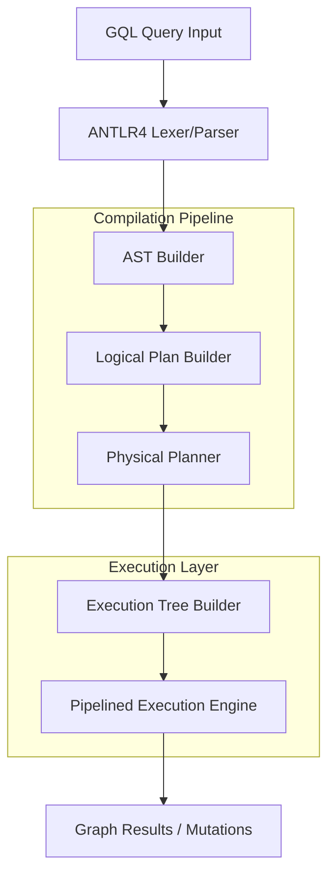

# GQL Engine
**A high-performance C++ Graph Query Language engine based on ISO GQL standards.**

GQL is a fast, light-weight, and portable embedded graph database engine that brings the power of the new ISO GQL (Graph Query Language) standard to a seamless compilation-execution pipeline.

Built with a compiler-inspired architecture, GQL translates high-level queries into optimized physical execution trees, making it an ideal core for applications requiring robust graph analytical capabilities.

## Features
- **ISO GQL Standard** - Implementation based on the ISO/IEC 39075:2024 GQL specification.
- **Pattern Matching** - Powerful `MATCH` clauses for complex graph traversal.
- **Pipelined Execution** - Volcano-style "Open-Next-Close" iterator engine for efficient processing.
- **Query Optimization** - Multi-stage optimization including logical filter pushdown and physical scan selection.
- **Graph Workbench** - Integrated Web-based UI for query execution and graph visualization.
- **Pure C++17** - Memory-efficient and performant implementation using modern C++ standards.

## Architecture Overview
The engine utilizes a compiler-inspired architecture to translate high-level GQL into low-level physical operators through several distinct phases.


```mermaid
graph TD
    A[GQL Query Input] --> B[ANTLR4 Lexer/Parser]
    B --> C[AST Builder]
    C --> D[Logical Plan Builder]
    D --> E[Physical Planner]
    E --> F[Execution Tree Builder]
    F --> G[Pipelined Execution Engine]
    G --> H[Graph Results / Mutations]
    
    subgraph "Compilation Pipeline"
    C
    D
    E
    end
    
    subgraph "Execution Layer"
    F
    G
    end
```

## Prerequisites
Before building GQL, ensure you have the following installed:

### System Requirements
- **GCC/G++**: Version 9 or higher (C++17 support)
- **ANTLR4 C++ Runtime**: Required for the parsing layer (`sudo apt install libantlr4-runtime-dev`)
- **Node.js & npm**: Required for the Web Workbench

## Getting Started
Get up and running with GQL in 3 simple steps:

### Step 1: Compilation
Clone the repository and build the engine using the provided script:

```bash
git clone https://github.com/vaibhavKondekar/GQL.git
cd GQL
./build.sh
```
This will generate the `gqlparser` binary in the root directory.

### Step 2: Run a Query (CLI)
Execute a demonstration query against the built-in eCommerce dataset:

```bash
./gqlparser tests/demo/demo5_complex.gql
```

### Step 3: Launch the Workbench (Web UI)
To use the interactive Web UI, start the backend and frontend services:

**Terminal 1: Backend API**
```bash
cd web/backend
node server.js
```

**Terminal 2: Frontend UI**
```bash
cd web/frontend
npm run dev
```
Navigate to `http://localhost:5173` to start exploring your graph.

## Using GQL Like SQLite
GQL follows the same embedded database pattern as SQLite, making it familiar for developers:

| Aspect | SQLite | GQL Engine |
| :--- | :--- | :--- |
| **Architecture** | Embedded, file-based | Embedded, In-memory/File-based |
| **Server** | No daemon required | No daemon required (CLI-first) |
| **Parsing** | SQL Standard | ISO GQL Standard |
| **Execution** | Pipelined | Pipelined (Volcano Model) |
| **Storage** | Single file | Directory/JSON representation |

## Project Structure
- `src/` - Engine source code (AST, Planning, Execution)
- `tests/` - Categorized test suite (Basic, Medium, Complex)
- `grammar/` - ISO GQL `.g4` grammar files
- `web/` - Workbench Frontend (Vite/React) and Backend (Node.js)
- `generated/` - ANTLR4 generated target files

## Testing
GQL includes a comprehensive test suite categorized by complexity:
- **Demo**: Curated demonstration queries for eCommerce analytics.
- **Simple**: Basic `MATCH` and filter operations.
- **Medium**: DML (INSERT, SET, DELETE), Joins, and Aggregations.
- **Difficult**: Deep path traversal and complex analytical queries.

Run tests by executing the binary with any `.gql` file in the `tests/` directory.

## License
This project is licensed under the **Academic License**. See the [LICENSE](LICENSE) file for details.

## Acknowledgements
- **ANTLR4** - For the powerful parser generation.
- **ISO/IEC 39075:2024** - For the Graph Query Language specification.
- **OpenGQL** - Inspiration for grammar optimization.

---
**Developed by Vaibhav Kondekar**  
*Advancing methodologies in Graph Query Processing.*

